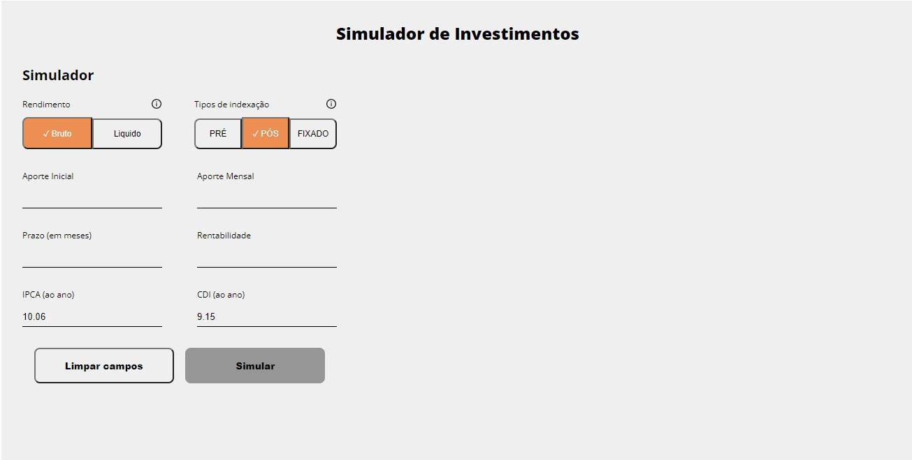
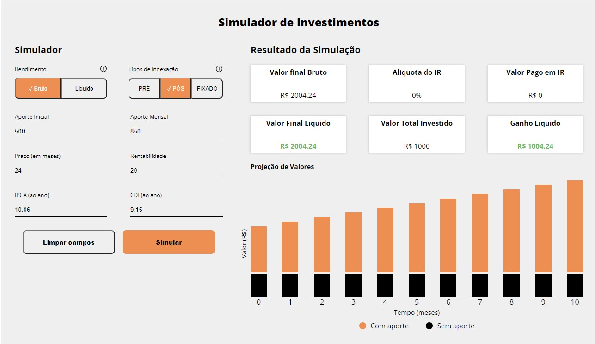

# Simulador de investimentos

## Sobre

Simulador de investimentos onde o usuário pode realizar uma simulação de rendimentos de acordo com o tipo de indexação e tipo de rendimento escolhido

Obs.: o resultado é consumido através de uma API Fake

## Linguagens

- HTML (JSX)
- CSS
- JavaScrip
- ReactJS

## Diferenciais

- Responsividade em todos os dispositivos
- Prettier para formatação
- Otimização SEO com palavras chaves na meta tag

## Preview
Simulador não preenchido

    

Validação de formulário

    

Resultado da simulação

    

## Como usar

Para testar esse simulador no seu browser, siga o passo a passo:

#1 - Siga as instruções para baixar e instalar a API disponível no link: https://github.com/eqi-investimentos/desafio-fake-api (a API ficará localizada em http://localhost:3000)

#2 - Faça o download deste repositório e instale as dependências através do 'npm install' na pasta raiz

#3 - Execute o projeto  com 'npm start' (o projeto irá abrir na porta http://localhost:8080/)